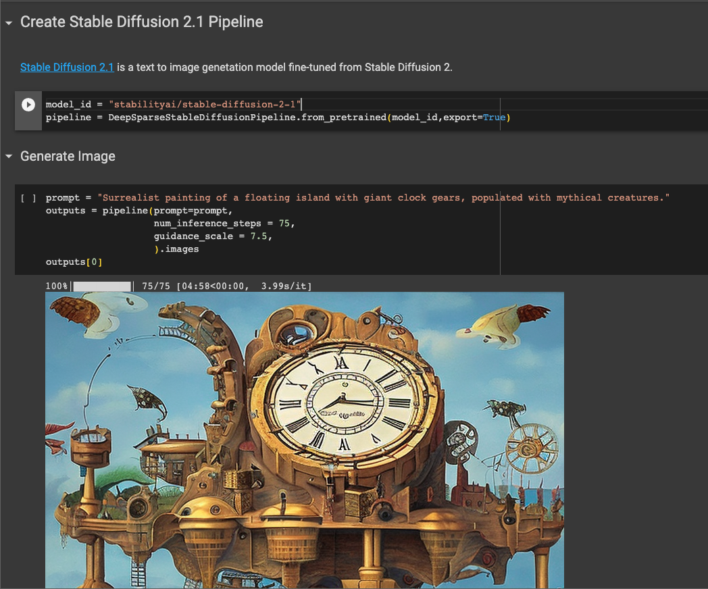
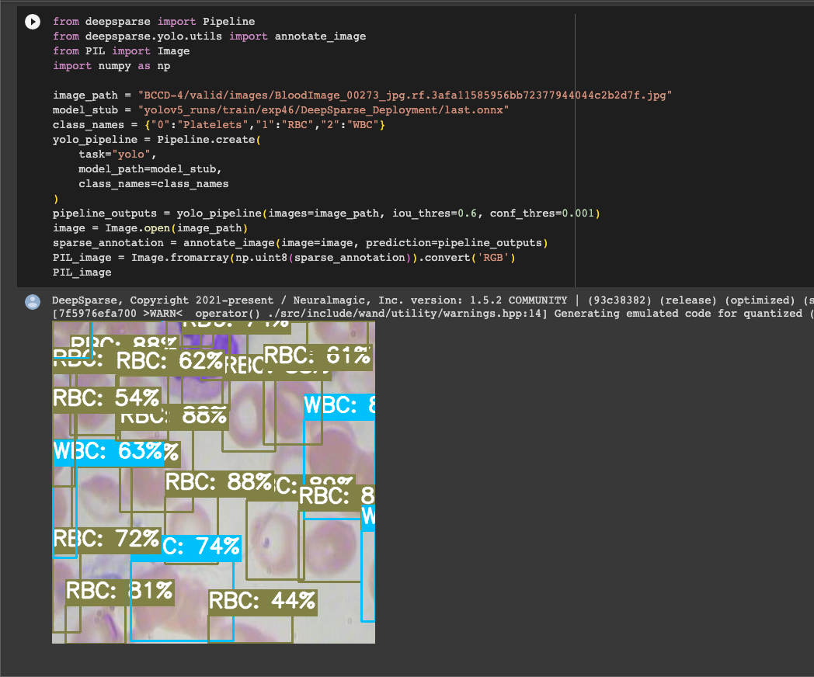
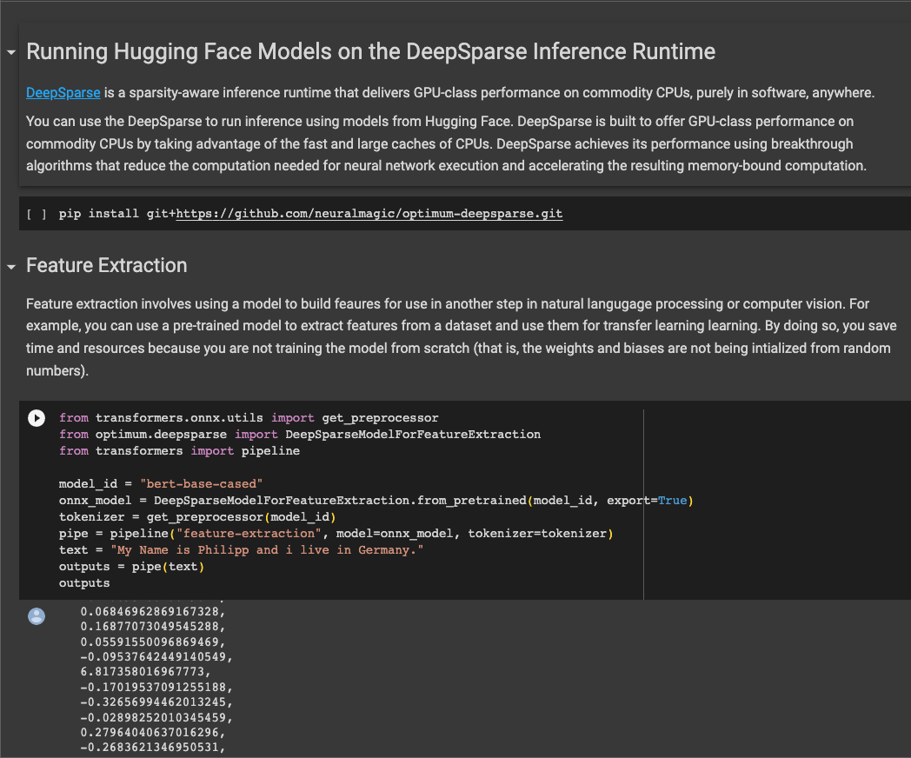

# Neural Magic 🪄 Model Optimization Examples 

Deep learning models have grown bigger over the years making their deployment complex and expensive. [Neural Magic](https://github.com/neuralmagic) 
is building model optimization tools to change this narrative.  We provide tools for optimizing these models to make them more 
performant and easier to deploy. For example, you can use [SparseML](https://github.com/neuralmagic/sparseml) to
make your model sparse in a couple of lines of code. Neural Magic also provides numerous optimized natural language and computer  vision models on the
[SparseZoo](https://sparsezoo.neuralmagic.com/). When you are ready to move to production, you can take advantage of the [DeepSparse](https://github.com/neuralmagic/deepsparse) 
inference runtime to achieve GPU-class performance on commodity CPUs. 

In this repository, you will find examples that show how to use Neural Magic's tools to apply optimizations on your models.
You will also find examples on how to use Neural Magic's libraries with other machine learning packages. 

## Highlighted Notebooks 
Here are three notebooks you can look at immediately: 

### Stable Diffusion on CPUs With DeepSparse

In this notebook, you will learn how to perform text-to-image generation on DeepSparse using stable diffusion models. 
DeepSparse accelerates inference, enabling the images to be generated on commodity CPUs. 

### Optimize YOLOv5 Model With SparseML

This notebook will take you through the process of optimizing a YOLOv5 model for real-time object detection. You will also 
learn how to deploy the resulting model on CPU using DeepSparse. 

### Run Hugging Face Models on DeepSparse

DeepSparse supports numerous transformer models. This notebook illustrates how to pull models from Hugging Face using 
Optimum and run them on CPU using DeepSparse. 

## Bugs and Contribution 
Let us know in case something isn't working by [creating an issue](https://github.com/neuralmagic/examples/issues). You 
can also propose a fix by [submitting a pull request](https://github.com/neuralmagic/examples/pulls). Join our 
[Slack community](https://join.slack.com/t/discuss-neuralmagic/shared_invite/zt-q1a1cnvo-YBoICSIw3L1dmQpjBeDurQ) to 
engage with other practitioners or inform us of any examples you'd like to see. 
