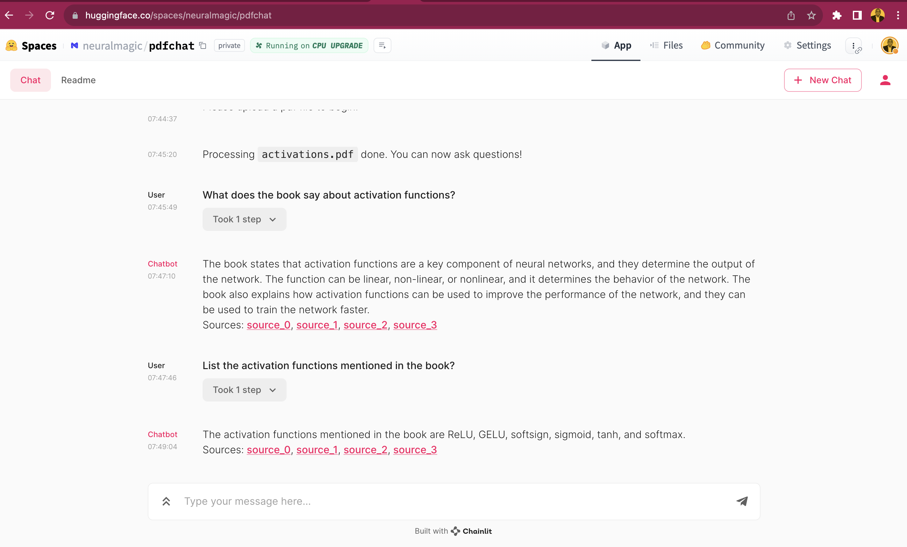

# Run LLMs on CPU With LangChain and DeepSparse: Chat With PDF Demo

[](https://huggingface.co/spaces/neuralmagic/pdfchat)

This examples demostrates how to run a PDF chatbot on CPUs using [DeepSparse](https://github.com/neuralmagic/deepsparse/), [LangChain](https://github.com/langchain-ai/langchain) and [Chainlit](https://github.com/Chainlit/chainlit). The project can run on a CPU with 16GB of RAM. DeepSparse provides accelerated inference on CPUs by taking advantage of a model's sparsity to deliver GPU-class performance on CPUs. 

## Installation 
Clone the repo and install the required packages to get started: 

```bash
pip install -r requrements.txt

```
## Start With Chainlit

```bash
chainlit run app.py -w
```

