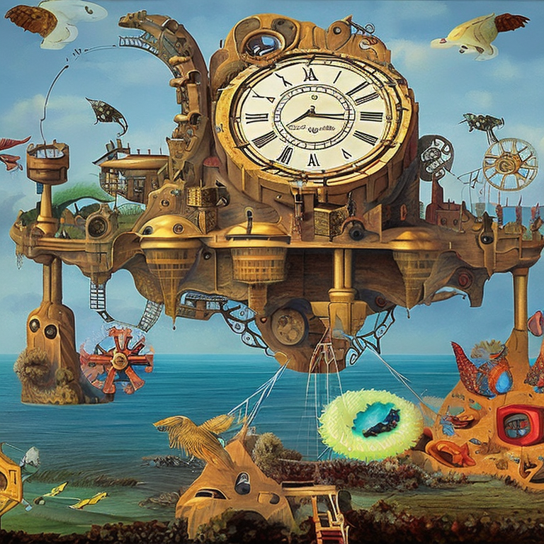

# Generate Images With Stable Diffusion Using Optimum-DeepSparse
[Optimum DeepSparse](https://github.com/neuralmagic/optimum-deepsparse) provides accelerated machine learning inference on CPUs using the [DeepSparse Inference Runtime](https://github.com/neuralmagic/deepsparse). 

This notebook shows how to perform text to Image generation using DeepSparse.

[](https://colab.research.google.com/github/neuralmagic/notebooks/blob/main/notebooks/deepsparse-stable-diffusion/notebook.ipynb)

## Install Optimum-Deepsparse
```bash
pip install git+https://github.com/neuralmagic/optimum-deepsparse.git
```
## Generate Image 

```python
model_id = "stabilityai/stable-diffusion-2-1"
pipeline = DeepSparseStableDiffusionPipeline.from_pretrained(model_id,export=True)
prompt = "Surrealist painting of a floating island with giant clock gears, populated with mythical creatures."
outputs = pipeline(prompt=prompt, 
                   num_inference_steps = 75, 
                   guidance_scale = 7.5,
                   ).images
outputs[0]
```
