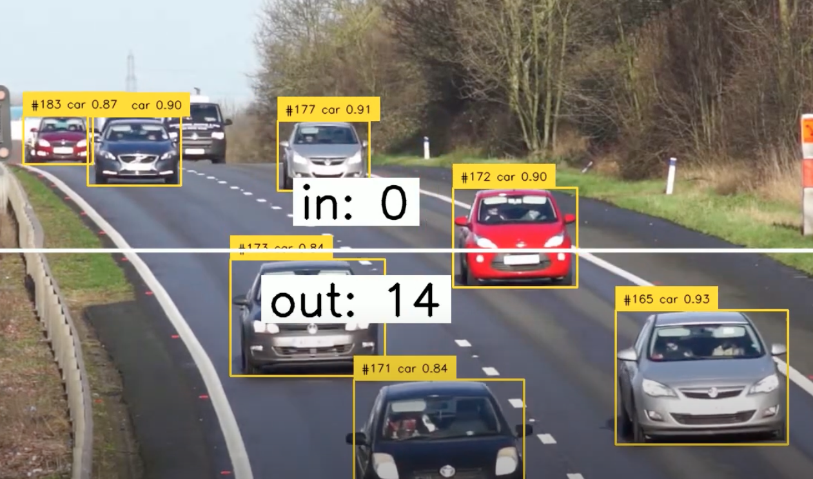

# How to use DeepSparse YOLOv5 and YOLOv8 Pipelines With Supervision
[](https://colab.research.google.com/github/neuralmagic/notebooks/blob/main/examples/supervision/supervision.ipynb)

[DeepSparse](https://github.com/neuralmagic/deepsparse) offers accelerated inference on CPUs for natural language and computer vision tasks, leading 
to GPU-class performance on CPUs. DeepSparse does this purely in software by taking advantage of sparse models.
Common object detection models such as YOLOv5 and YOLOv8 are supported in DeepSparse. 

In this notebook, you will learn how to perform object detection and tracking using DeepSparse and [Supervision](https://github.com/roboflow/supervision). Supervision provides a set of 
tools for reducing repetitive work such as creating zones when building computer vision applications. 
```bash
pip install supervision deepsparse[yolo]
```
Here is a code snippet showing how to track, detect and count cars on a highway using this [video](https://www.youtube.com/watch?v=-vLTFQv2_Vo):

```python
import numpy as np
import supervision as sv
from deepsparse import Pipeline
classes = {2: "car", 3:"motorcycle", 5:"bus", 7:"truck"}

VIDEO_PATH = "video.mp4"

LINE_START = sv.Point(0, 360)
LINE_END = sv.Point(1280, 360)

video_info = sv.VideoInfo.from_video_path(VIDEO_PATH)

# extract video frame
generator = sv.get_video_frames_generator(VIDEO_PATH)
iterator = iter(generator)
frame = next(iterator)

byte_tracker = sv.ByteTrack()
line_counter = sv.LineZone(start=LINE_START,end=LINE_END)
line_annotator = sv.LineZoneAnnotator(thickness=4, text_thickness=4, text_scale=2)
box_annotator = sv.BoxAnnotator(thickness=2,text_thickness=1, text_scale=0.5)

# detect
model_stub = "zoo:cv/detection/yolov5-m/pytorch/ultralytics/coco/pruned70_quant-none"
yolo_pipeline = Pipeline.create(task="yolo",model_path=model_stub)
pipeline_results = yolo_pipeline(images=frame, iou_thres=0.6, conf_thres=0.001)
detections = sv.Detections.from_deepsparse(pipeline_results)
detections = detections[
                        ((detections.class_id == 2) |
                        (detections.class_id == 3)  |
                        (detections.class_id == 5)  |
                        (detections.class_id == 7)) &
                        (detections.confidence > 0.5)
                        ]
# track objects
detections = byte_tracker.update_with_detections(detections)
# Create labels
labels = [ f"#{tracker_id} {classes[class_id]} {confidence:0.2f}" for _, _, confidence, class_id, tracker_id in detections ]

# annotate
frame = box_annotator.annotate(scene=frame,  detections=detections,labels=labels)
line_counter.trigger(detections=detections)
line_annotator.annotate(frame=frame, line_counter=line_counter)

# plot results
%matplotlib inline
sv.plot_image(frame, (16, 16))
```

Check out the notebook for how to perform tracking, counting, detection and annotation on the entire video. 