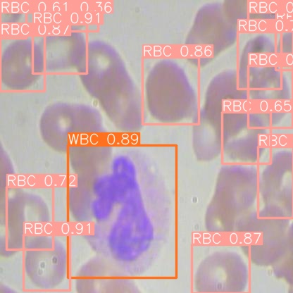

# Sparsify YOLOv5 Models Trained With Ultralytics
[](https://colab.research.google.com/github/neuralmagic/examples/blob/main/notebooks/yolov5-custom-data/yolov5-custom-data.ipynb)

YOLOv5 by Ultralytics is one of the most popular object detection models. In this notebook, we will look at how to fine-tune the model on a custom dataset. 

You can prepare the object detection dataset manually. However, in this case, we will use a dataset from the Roboflow Universe. Roboflow allows you to annotate and download computer vision datasets in various formats. 

We will first look at training the YOLOv5 on the red blood cells dataset. After that, we will look at how to make the model smaller for deployment by sparsifying it using SparseML. 

Sparsification can be done through pruning and quantization. Pruning removes unnecessary weights and activations from an over-parameterized network, leading to a smaller model, while quantization reduces the precision of the values in the network. 

The required packages are: 
- [SparseML](https://neuralmagic.com/sparseml/) for model optimization 
- [Roboflow](https://roboflow.com/) to download the dataset 
- [Ultralytics](https://ultralytics.com/) to train the Yolov5 model 
- [DeepSparse](https://neuralmagic.com/deepsparse/) for model deployment 

```python
pip install sparseml[yolov5]  roboflow  ultralytics deepsparse
```
In the end we will use this script to annotate the images and get the following result: 

```python
from deepsparse import Pipeline
from deepsparse.yolo.utils import annotate_image
from PIL import Image
import numpy as np

image_path = "BCCD-4/valid/images/BloodImage_00273_jpg.rf.3afa11585956bb72377944044c2b2d7f.jpg"
model_stub = "yolov5_runs/train/exp46/DeepSparse_Deployment/last.onnx"
class_names = {"0":"Platelets","1":"RBC","2":"WBC"}
yolo_pipeline = Pipeline.create(
    task="yolo",
    model_path=model_stub,
    class_names=class_names
)
pipeline_outputs = yolo_pipeline(images=image_path, iou_thres=0.6, conf_thres=0.001)
image = Image.open(image_path)
sparse_annotation = annotate_image(image=image, prediction=pipeline_outputs)
PIL_image = Image.fromarray(np.uint8(sparse_annotation)).convert('RGB')
PIL_image
```


